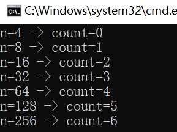

# 时间复杂度线上作业

## 一.选择题

1. 下面算法的时间复杂度是（ D ）

   ```c
   void fuc(int n) {
       int i, j, s = 0;
       for (i = 0, j = 0; i < n; i += j, j++) s = s + j;
       printf("s=%d\n", s);
   }
   ```

   A.	$O(\log_2n)$	B.	$O(n^2)$	C.	$O(n)$	D.	$O(\sqrt{n})$ 

解析：循环结束条件由**i**与**n**决定，**i**每次循环都加**j**

​				设循环执行**x**次，则**i**的变化为$$i=\sum_{p=1}^{x}{p}=\frac{x\times (x+1)}{2}$$

​					$\therefore x\approx \sqrt{2\times n}$			$\therefore T(n)=O(\sqrt{n})$		


2. 将下列复杂度由小到大重新排序：（ B ）

   1. $n*\log_2n$		2. $n+n^2+n^3$		3. $2^4$		4. $n^{0.5}$

   A. 3,4,2,1   B. 3,4,1,2   C. 4,3,2,1   D. 4,3,1,2

解析：$n+n^2+n^3$的时间复杂度可用$O(n^3)$表示

​				$2^4$的时间复杂度可用$O(1)$表示

​				$n^{0.5}$的时间复杂度为$O(\sqrt{n})$


3. 设n是描述问题规模的非负整数，下列程序片段的时间复杂度是（ A ）

   ```c
   x = 2;
   while (x < n / 2) x = 2 * x;
   ```

   A. $O(\log_2n)$		B. $O(n)$		C. $O(n\log_2n)$		D. $O(n^2)$

解析：循环条件由**n**和**x**决定，设程序执行次数为**k**，则$x=2^{1+k}$

​				$\therefore 2^{1+k}<\frac{n}{2}$			$\therefore T(n)=\log_2(n)-2=O(log_2n)$

## 二.填空题

1. 下面程序段的时间复杂度为（O(nm)）

   ```c
   for (i = 0; i < n; i++)
       for (j = 0; j < m; j++)
           a[i][j] = (i > j) ? (i * i * i) : (j * j * j);
   ```

2. 设n为大于1的正整数， 计算机执行下面的语句时，带#语句的执行次数为（ n ）

   ```c
   i = 1, j = 0;
   while (i + j <= n) {
     # if (i > j) j++;
       else i++;
   }
   ```

   解析：循环条件由**i、j、n**决定，**i**和**j**换着增长1，而循环结果由**i + j**和**n**比较，所以程序执行次数为**n**，每次循环都会执行# if 判断语句，所以执行次数为**n**

3. 假设n为2的乘幂，并且n>2，试求下列算法的时间复杂度及变量count的值（以n的函数形式表示，在本课程作业和考试范围内，除非特别声明，对数都是以2为底，即log2n可表示为：log n或者log(n)；m*n的形式可表示为mn）。

   ```c
   int time(int n) {
       int count = 0, x = 2;
       while (x < n / 2) {
           x = 2 * x;
           count++;
       }
       return (count);
   }
   ```

   时间复杂度：$O(\log_{}n)$			count值：$\log_{}(n)-2$

   解析：同选择题第3题，可通过以下程序验证结论：

   ```c
   int num = 7, n = 2;
   for (int i = 0; i < num; ++i) {
       n *= 2;
       cout << "n=" << n << " -> count=" << time(n) << endl;
   }
   ```

   

